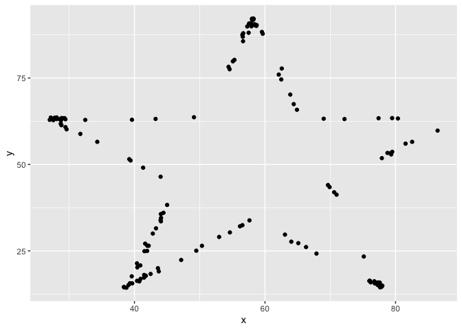

Lab 01 - Hello R
================
Marq Schieber
1/21/2022

## Load packages and data

``` r
library(tidyverse) 
library(datasauRus)
```

## Exercises

### Exercise 1

1846 rows and 3 variables/columns

### Exercise 2

``` r
dino_data <- datasaurus_dozen %>%
  filter(dataset == "dino")

ggplot(data = dino_data, mapping = aes(x = x, y = y)) +
  geom_point()
```

<!-- -->

``` r
dino_data %>%
  summarize(r = cor(x, y))
```

    ## # A tibble: 1 × 1
    ##         r
    ##     <dbl>
    ## 1 -0.0645

### Exercise 3

``` r
star_data <- datasaurus_dozen %>%
  filter(dataset == "star")

ggplot(data = star_data, mapping = aes(x = x, y = y)) +
  geom_point()
```

<!-- -->

Meaningful text: this is cool. I got this on my first go…yaya!

``` r
star_data %>%
  summarize(r = cor(x, y))
```

    ## # A tibble: 1 × 1
    ##         r
    ##     <dbl>
    ## 1 -0.0630

The correlation of the star data is very similar to the dino data.

### Exercise 4

``` r
circle_data <- datasaurus_dozen %>%
  filter(dataset == "circle")

ggplot(data = circle_data, mapping = aes(x = x, y = y)) +
  geom_point()
```

<!-- -->

``` r
circle_data %>%
  summarize(r = cor(x, y))
```

    ## # A tibble: 1 × 1
    ##         r
    ##     <dbl>
    ## 1 -0.0683

The correlation is slightly larger than dino, but smaller than star.

### Exercise 5

Add code and narrative as needed.

To add R chunks either type out the backticks, curly braces, and the
letter `r` or use the Insert chunk button above, green C+.

## Bonus Tips by Yoo Ri

Here are some helpful tips :)

-   filter() is for extracting rows

-   group_by() is for grouping datasets by assigned column

-   ungroup() cancels the grouping

-   summarize() is often used with group_by(). This function can print
    the output according to the group_by().

-   facet_grid(y\~x,…) creates a grid with variable y as a row, variable
    x as a column  

-   facet_wrap(x,… ) is useful when there is only one variable
